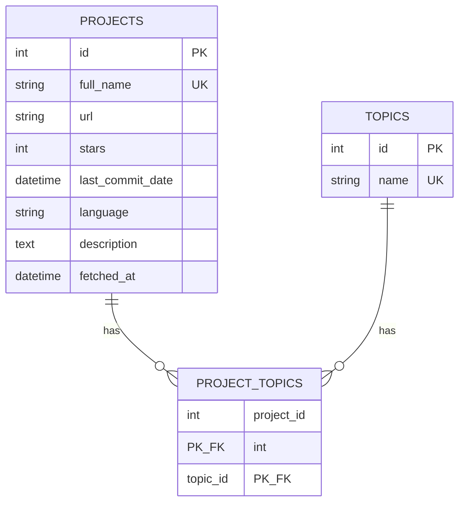

# データベース設計ドキュメント

## 概要
- SQLite + SQLAlchemy を採用し、正規化・拡張性・検索性能・命名の明確化を重視。
- ドメイン名は Repository と区別するため Project を採用。

## テーブル概要
### projects
- GitHub プロジェクトの基本情報を保持。
- 主なカラム: `id`(PK)、`full_name`(UNIQUE/INDEX)、`url`、`stars`(INDEX)、`last_commit_date`(INDEX)、`language`、`description`、`fetched_at`(UTC 現在時刻)。
- 役割: 重複排除、スター順ソート、データ鮮度管理。

### topics
- topic マスタ。
- カラム: `id`(PK)、`name`(UNIQUE/INDEX)。
- 役割: topic 名の正規化と再利用。

### project_topics
- projects と topics の多対多中間テーブル。
- カラム: `project_id`(FK CASCADE)、`topic_id`(FK CASCADE)、複合主キー(`project_id`, `topic_id`)。
- 役割: topic ベースの検索と集計を効率化。

## SQLAlchemy モデル要点
- すべて `Base` を継承し、`Base.metadata.create_all(bind=engine)` の対象。
- `Project.topics` / `Topic.projects` は `secondary="project_topics"` で多対多を表現、`back_populates` と `lazy="selectin"` で N+1 を回避。
- `fetched_at` は `datetime.now(UTC)` で自動設定しデータ鮮度を記録。

## 設計判断メモ
- topic を正規化した理由: LIKE 検索の低速化回避、整合性確保、統計取得を容易にするため。
- `Project` 命名: Repository パターン実装との混同防止。
- `fetched_at`: 取得済みデータの更新タイミング判断に利用。

## 運用ノート
- 初期化は `mb_scanner.db.session.init_db()` を呼び、モデルを import 済みにしてから `create_all` を実行。
- 操作用途: `SessionLocal()` からサービス層（`ProjectService`, `TopicService` など）を利用。
- 今後の検討: Alembic によるマイグレーション、自動ページネーションやキャッシュ、分析テーブル追加。

## ER 図

